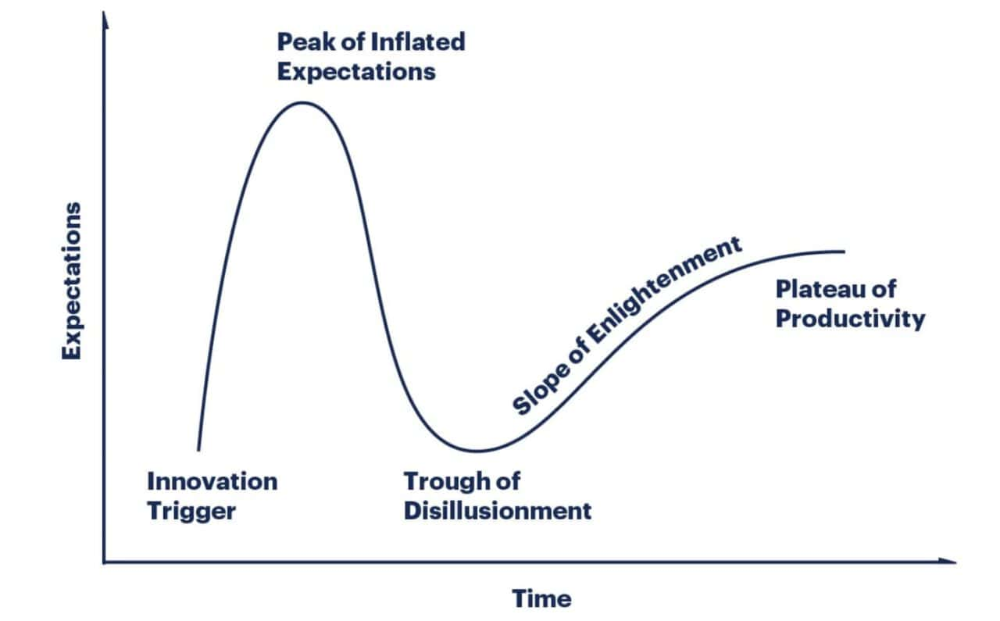

# AI For Everybody

# Week 6: from Tools to Systems
Kate Weber, Ph.D.Faculty Director for AI in Medical Education, CWRU

# Building your AI Workflow

Orchestration: Building multi-tool workflows

Scite.ai: The verification engine for 2026

Clinical agents: The future already happening

Live demo: Full pipeline in action

Series synthesis: Your complete toolkit

Final assignment: Personal workflow map

---

Yay! Last week!
What’s changed in how you think about AI?
Today ties together everything from Weeks 1-5
Less new content, more integration
By end of session, they'll have a complete workflow system
This is the transition from learning to implementation

# Our Journey So Far

__Week 1-2: Foundation__

Model selection

Reasoning vs prediction tradeoffs

Context windows & use cases

__Week 3: The Craft__

Five Pillars of Prompting

Engineering vs chatting

Your Prompt library

__Week 4: Safety Net__  (material available)

Chain of Verification

Red-Team auditing

Understanding hallucinations

__Week 5: Grounding__

NotebookLM for your documents

Custom GPTs for your workflows

RAG

# Orchestration

__Why Not Just Use One Tool?__

Single-point-of-failure: One hallucination ruins everything

Lack of specialization: General tools aren't optimized for verification

No audit trail: Can't trace where information came from

__The Orchestration Principle__

Different tools for different stages

Each tool's output becomes next tool's input

Built-in verification at each handoff

Human oversight at critical junctions

The systematic chaining together of multiple AI tools

---

This is the most important conceptual shift
Professional AI use = multi-tool orchestration
Medical analogy: Like using different specialists for different diagnoses
Emphasize: This is the NEW skill for 2026

# Four-Stage Pipeline

__Verification__

(Find Evidence)

__Synthesis__

(Organize it)

__Drafting__

(Production)

__Audit__

(Validate)

__Verification__

(Find Evidence)

__Synthesis__

(Organize it)

__Drafting__

(Production)

__Audit__

(Validate)

_[Scite.ai](http://scite.ai)_

Consensus

PubMed

NotebookLM

Claude

CustomGPT

Claude

GPT-5

Audit Techniques:

Red-Team

CoVe

---

This is the template for professional AI workflows
Not every task needs all three stages
But understanding the architecture helps with any task
Show example: Literature review uses all three

# Quick Review on Audit:

Ask AI to generate information based on your grounded sources

Ask AI to extract every claim in the output from Step 1

Ask AI to cite the exact sentence/table in the source document OR indicate that that item is unverified

Create a final summary of only verified information

_[Example from my own drafting](https://claude.ai/share/85d0aac2-6368-4ea9-8542-17f1a7121675)_ :

# Tool Spotlight: scite.ai

Smart Citations

Reference Check

GPT-5.2 Integration

Topic Notifications

---

- Scite is THE verification layer for 2026
- This is what separates amateur from professional AI use
- Free version available, premium for power users
- This tool alone prevents most hallucination problems

# Demo

Sources from Scite

Summary Table from NotebookLM

Briefing from Gemini

Ratification/Audit in Gemini

# What We Did

__Verification__

(Find Evidence)

__Synthesis__

(Organize it)

__Drafting__

(Production)

__Audit__

(Validate)

Searched in Consensus:17 papers

8 supporting

NotebookLM:

Generated Table

Gemini:

Drafted Summary

Gemini:

Ran CoVe Audit

---

This is the template for professional AI workflows
Not every task needs all three stages
But understanding the architecture helps with any task
Show example: Literature review uses all three

# Use Cases

|  | __Verification__ | __Synthesis__ | __Drafting__ | __Audit__ |
| :-: | :-: | :-: | :-: | :-: |
| __Lit Review__ | Scite topic notifications | NotebookLM of papers | Custom GPT for standardized format | Cross-check key claims |
| __Grant Proposal__ | Consensus background evidence | Claude: Related work section | Custom GPT with formatting rules for agency | Verify statistics against original papers |
| __Patient Education__ | Scite for guidelines | NotebookLM for guideline extraction | GPT-4o for patient language | Medical review accuracy and appropriateness |
| __IRB Submission__ | PubMed for protocol precedents | NotebookLM for similar study designs | Custom GPT with IRB template | Legal/ compliance review |

# The Rise of Clinical Agents

__Agents, in AI terms: __ (NOT what ai.case.edu calls an “agent”)

AI that takes actions, not just answers questions

Can access multiple tools autonomously

Makes decisions within guardrails

Requires human oversight at critical points

__Chart Hero __  __(Penn Medicine)__

Chat-based AI that synthesizes patient records within the EHR

Suggests courses of action with outputs tied to source data

One-click access to relevant patient information

__Ambient Scribes __  __(Sunoh.ai, Abridge)__

Converts patient conversations to structured notes in real time

Physician reviews and approves all output before finalizing

Fastest-adopted generative AI tool in healthcare

__Clinical Decision Support __  __(Epic + GPT-4)__

Evidence-based  __alerts__  and recommendations embedded in EHR workflows

Physician retains final decision authority; all AI outputs are drafts

# Agent Safety & Oversight

Required Safeguards:

__Transparent Sourcing__ : Every agent recommendation must cite source

__Confidence Scoring__ : Agent must indicate certainty level

__Human Approval__ : No autonomous execution of critical actions

__Audit Trail__ : Complete record of agent's reasoning process

__Fail-Safe Defaults__ : When uncertain, escalate to human

---

**Red Flags to Watch:**
- Agent making recommendations without citations
- No confidence scores provided
- Pressure to accept suggestions without review
- Missing audit trail
- Claims of "human-level" or "superhuman" performance

**The Professional Standard:**
- Use agents as research assistants, not decision makers
- Always verify critical claims
- Maintain your clinical judgment
- Document your decision-making process

**Speaker Notes:**
- This connects to Week 4's ethics discussion
- Agents are powerful but require discipline
- The human clinician's role is more important, not less
- Professional responsibility cannot be delegated to AI

# Hands-On: Design a Workflow

 __TASK: [What you're accomplishing]__ 

 __INPUT: [What you start with]__ 

 __OUTPUT: [What you need to deliver]__ 

 __STAGE 1 - VERIFICATION:__ 

 __Tool: [Scite/Consensus/PubMed]__ 

 __Action: [What verification happens]__ 

 __Output: [What moves to Stage 2]__ 

 __STAGE 2 - SYNTHESIS:__ 

 __Tool: [NotebookLM/Claude/Custom GPT]__ 

 __Action: [How information is organized]__ 

 __Output: [What moves to Stage 3]__ 

 __STAGE 3 - DRAFTING:__ 

 __Tool: [Custom GPT/Claude/GPT-5]__ 

 __Action: [How final product is created]__ 

 __Output: [Draft for audit]__ 

 __AUDIT:__ 

 __What I'll verify manually: [Specific checks]__ 

 __Red flags to watch for: [Potential errors]__ 

 __HUMAN ESCAPE HATCH:__ 

 __Decision points requiring my judgment: [Critical junctions]__ 

* Choose your Task
* Map the Stages
  * Verification
  * Synthesis
  * Drafting
  * Audit
* Identify Pain Points
  * Hallucinations?
  * Critical verification?
  * Must-have human judgment?
  * Documentation?
---

- "Who wants to share their workflow design?"
- "What verification stage felt most critical for your task?"
- "Where will you apply human judgment?"

**Capture Patterns:**
- Note common tasks across participants
- Identify shared pain points
- Celebrate innovative tool combinations
- Build shared workflow library

**Discussion Questions:**
- Which stage do you think will save you the most time?
- Where are you most worried about errors?
- How will you know if your workflow is working?
- What support do you need to implement this?

**Speaker Notes:**
- Have 2-3 backup examples if participants are shy
- Encourage peer learning
- Note workflows that could be shared department-wide
- Offer to help refine workflows after session

# Going Deeper

Check with multiple models for consensus

Automate your audit pipelines

Keep track of your prompts

Build connections to tools with Python and an API

# Staying Current

__Model Performance__

Artificial Analysis:  _[https://artificialanalysis.ai/](https://artificialanalysis.ai/)_

LMSYS Chatbot Arena _[https://arena.ai/](https://arena.ai/)_

__Professional Development__

_[CWRU AI Playground](https://case0.sharepoint.com/sites/CWRUAIPlayground/SitePages/ITHelpdeskHome.aspx)_

AAMC Communities and Seminars

Vendor Roadmaps

__Research Tools__

Scite Topic Notifications

Consensus Weekly Digest

PubMed AI Updates

# The Hype Curve

# Key Takeaways

__The Three-Stage Pipeline__

VERIFICATION (Find evidence)

SYNTHESIS (Organize information)

DRAFTING (Create output) Plus: AUDIT before delivery

__Critical Principles__

Never use un-cited AI for clinical decisions

Verification is non-negotiable

Human oversight at critical junctions

Continuous learning required

Community support accelerates adoption

---

**Next Steps:**
1. **This Week:** Design one workflow for immediate use
2. **This Month:** Test and refine your workflow
3. **This Quarter:** Share with colleagues, build institutional library
4. **Ongoing:** Stay current, contribute to community

**Connection to Your Practice:**
- Start small: One workflow, used consistently
- Track time saved and quality improvements
- Document what works and what doesn't
- Share successes and failures with peers

**Speaker Notes:**
- Emphasize incremental implementation
- Perfection is not required, progress is
- Community learning accelerates everyone
- Offer ongoing support channels

